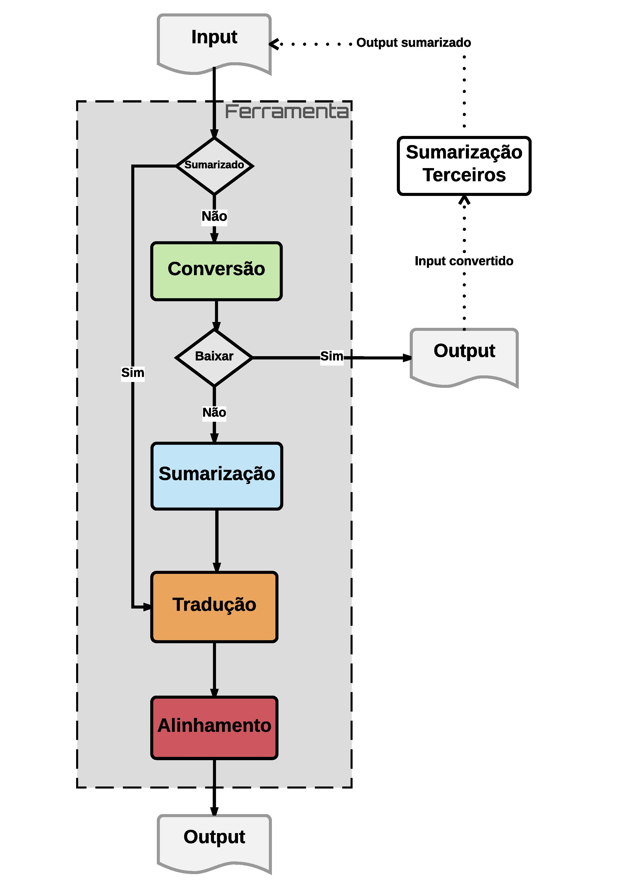

# Automatic Summarizer

## Apps

This project was made from a necessity to create a system that integrates convertion, summarization, translation and alignment of a corpus' file into one project called Automatic Summarizer.
So, since a pdf file, this Automatic Summarizer will do all of this 4 steps, described before, using existing APIs in Python for each one.
Next, each app and their purpose:

### Converter ([PDF Miner](https://github.com/euske/pdfminer))
This app converts PDF files into TXT format

### Summarizer ([Gensim](https://github.com/RaRe-Technologies/gensim))
This app summarizes the TXT file and return some metrics data

### Translator ([TextBlob](https://github.com/sloria/TextBlob))
This app translates the language of the TXT summarized file (e.g.: PT-BR -> FR)

### Aligner ([Gale & Church](https://github.com/vchahun/galechurch))
This app aligns the TXT summarized translated file

## Flowchart



## Configure

This project has a YAML file to configure database connection settings and others. The current path is `config/automatic_summarizer.yml`.

## Installation

To install the project, first your environment must have the docker installed (version 3.3).

After docker installed, you need to set the database configures on environments variables from db service (MySQL) in `docker-compose.yml` file.

Then, you can manage the `Dockerfile` using the orchestrator file `docker-compose.yml`.
```
docker-compose up -d
```

If you already have a complete environment with Django/MySQL installed and don't want to use Docker, you can just install the project dependencies and make some database changes.
```
./setup.py install
```

## References

- PDF Miner <https://github.com/euske/pdfminer>
- Gensim <https://github.com/RaRe-Technologies/gensim>
- TextBlob <https://github.com/sloria/TextBlob>
- Gale & Church <https://github.com/vchahun/galechurch>

## Credits

- Leandro Rezende Rodrigues <<leandro.l2r@gmail.com>>
- Prof. Francisco Cláudio S. de Menezes <<new.claudiomenezes@gmail.com>>
